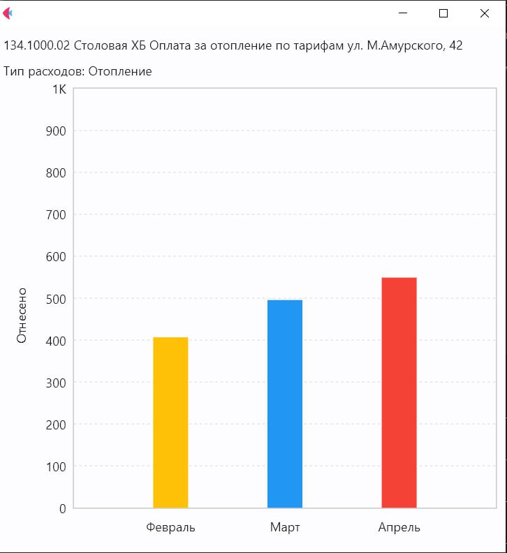

# ЭВИН
Эффективность вложений в недвижимость

# Как пользоваться

1. Установите следующие библиотеки, которые нужны для запуска кода:
```
pip install flet pandas glob keras scikit-learn tensorflow
```
2. Запустие файл main.ipynb

# Пользовательский интерфейс

Интерфейс является демострационным. 
Интерфейс загружает уже предсказанные значения затрат на период февраль - апрель 2022 года

 ## Запуск UI
 1. Перйдите в директорию ui/
 2. убедитесь, что библиотеки flet и pandas установлены
 3. запустите design.py
Так же ui представлен в виде приложения , скачать можете [тут](https://files.sberdisk.ru/s/fNhr3IKLlYUAhah)



